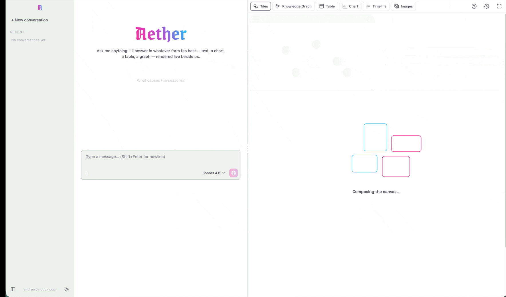
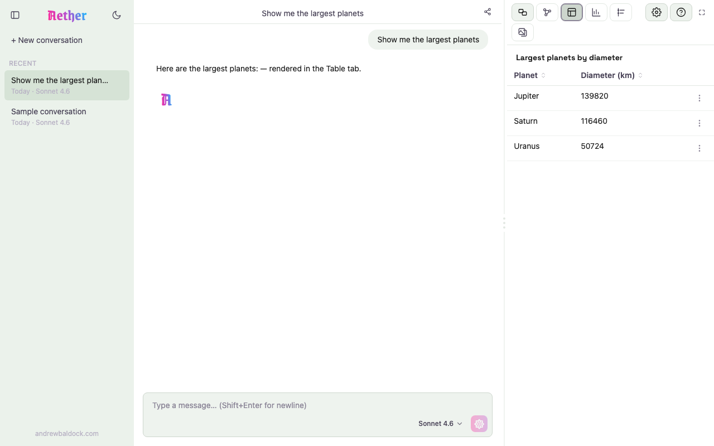
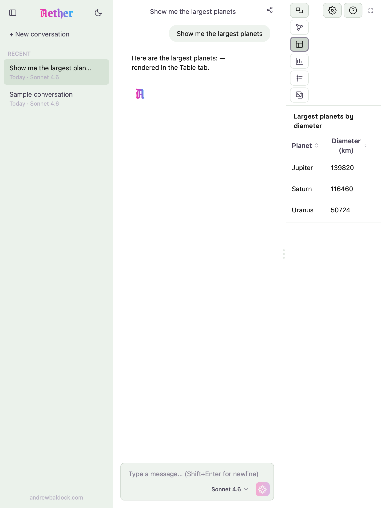
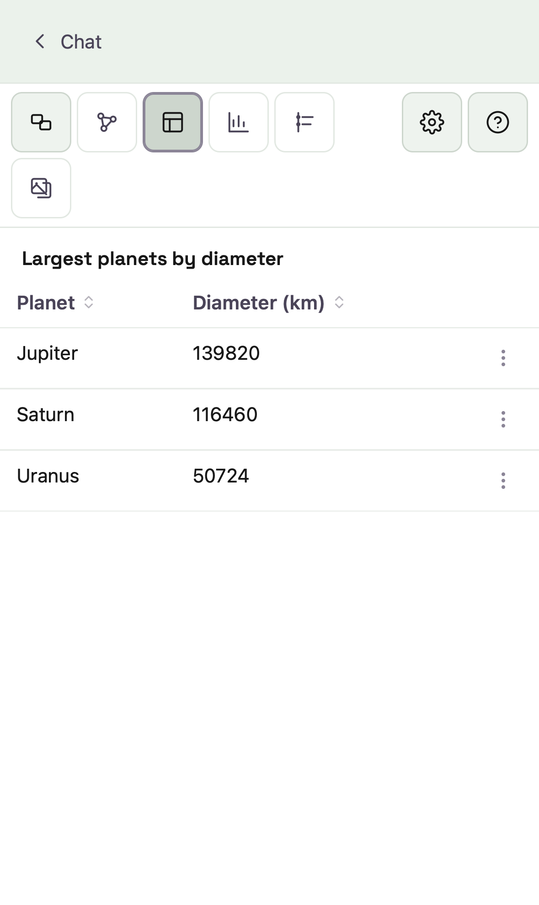

# Aether




> Ask questions. Get answers as 3D scenes, graphs, and charts.

[](https://react.dev)
[](https://bun.sh)
[](https://www.typescriptlang.org)
[](https://docs.claude.com)
[](https://aether.andrewbaldock.com)
[](./LICENSE)

A conversational explorer. The chat is the interface; answers are rendered in whatever form fits
best — table, chart, relationship graph, or 3D scene.

**The principle:** every view is a question answered in its best form.

🔗 **Live:** [aether.andrewbaldock.com](https://aether.andrewbaldock.com)

---

## Screenshots

Mobile-first, responsive across phone, tablet, and desktop. The chat drives a switchable result
panel — table, chart, relationship graph, 3D scene — selectable from the toolbar.

| Desktop | Tablet | Mobile |
|---|---|---|
|  |  |  |

<!-- TODO: GIF — ask a question → watch the answer render as a graph / 3D scene (the core "best form" moment). -->

---

## Architecture at a glance


A detailed, **auto-generated** map of every moving part. The image is page 1 (System Overview); the
source [`docs/diagrams/architecture.drawio`](docs/diagrams/architecture.drawio) has four pages
(overview · one chat turn · frontend internals · backend internals) — open it in
[draw.io](https://draw.io). It's generated from the live source by
[`tools/architecture-diagram/`](tools/architecture-diagram/README.md) (`bun run diagram`), so it
can't silently drift from the code. Full write-up in
[docs/ARCHITECTURE.md](docs/ARCHITECTURE.md).

---

## Documentation

- **[docs/GETTING_STARTED.md](docs/GETTING_STARTED.md)** — clone-to-running, step by step:
  toolchain, accounts/keys (minimum vs. full set), DB migrations, run, verify, common snags.
- **[docs/RUNBOOK.md](docs/RUNBOOK.md)** — day-to-day commands for dev, build, deploy, and
  management once you're set up, plus the Traps & Notes gotcha list.
- **[docs/STACK.md](docs/STACK.md)** — every dependency, what it does, why it was chosen, and
  its version. Kept current with the actual stack.
- **[docs/ARCHITECTURE.md](docs/ARCHITECTURE.md)** — how the frontend and backend fit together,
  the two-runtime model, the `/api` proxy wiring, and the testing strategy.
- **[docs/MOBILE.md](docs/MOBILE.md)** — mobile/responsive behavior, the PWA (installable +
  service worker), icon assets, and how mobile is tested.
- **[docs/DESIGN_SYSTEM.md](docs/DESIGN_SYSTEM.md)** — design tokens, the shared widget/admin-page
  shells, motion conventions, and composition patterns. See it live at `/style-guide`.
- **[docs/HISTORY.md](docs/HISTORY.md)** — how Aether unfolded commit by commit: the order things
  were built, the decisions made, and the dev rhythms behind them.

---

## Prerequisites

- **[bun](https://bun.sh)** ≥ 1.3 — the only thing you need installed. It runs the backend,
  installs packages, and runs the frontend dev server.

  ```bash
  curl -fsSL https://bun.sh/install | bash
  bun --version   # verify
  ```

Bun replaces Node, Docker & global tooling.

---

## Setup

```bash
git clone <repo-url> aether
cd aether

# install both packages
cd backend  && bun install && cd ..
cd frontend && bun install && cd ..

# configure the backend environment
cp backend/.env.example backend/.env
# then add your ANTHROPIC_API_KEY to backend/.env
```

The backend reads `backend/.env` (bun auto-loads it). `ANTHROPIC_API_KEY` is **required** to run
the backend — see [backend/.env.example](backend/.env.example). The root
[.env.example](.env.example) lists everything the project will use as it grows. `.env` files are
gitignored — never commit real keys.

---

## Run

The app has two halves — run each in its own terminal.

```bash
# terminal 1 — backend (Hono, port 8000)
cd backend
bun run dev

# terminal 2 — frontend (Vite, port 5174)
cd frontend
bun dev
```

Then open **http://localhost:5174**. The frontend proxies `/api` requests to the backend on
`:8000` (see [docs/ARCHITECTURE.md](docs/ARCHITECTURE.md#frontend--backend-wiring-the-api-proxy)).

> **Note:** this project is built incrementally — see [docs/ROADMAP.md](docs/ROADMAP.md). Set `ANTHROPIC_API_KEY` in `backend/.env` before running.

---

## Checks

**Before pushing**, run the whole repo in one command from the **root**:

```bash
bun run verify   # backend (typecheck + tests) + frontend (build + tests)
bun run check    # Biome lint + format check, both packages
```

`verify` runs the backend's `verify` and the frontend's **`build`** (not just `typecheck`) —
because `typecheck` and `build` resolve different TypeScript configs in the frontend, so a
project-references typecheck can false-green; `build` is the real gate.

Or run inside **either** `backend/` or `frontend/` individually:

```bash
bun run check        # Biome lint + format check
bun run check:fix    # Biome — apply fixes
bun run typecheck    # TypeScript type check
bun run build        # (frontend) type-check (tsc -b) + production build
```

---

## Project layout

```
aether/
├── frontend/   React 19 + TypeScript + Vite + Tailwind v4
├── backend/    Bun + Hono + Anthropic SDK + Supabase
├── docs/       stack + architecture docs (kept current)
├── .env.example
└── README.md
```

## Deploy

### Production URLs

| What | Service | URL |
|------|---------|-----|
| Frontend (React SPA) | Vercel | `https://aether.andrewbaldock.com` |
| Backend (Hono API) | Fly.io | `https://aether-ab-api.fly.dev` |
| Database | Supabase | `ltjnrftafphaampgihdf.supabase.co` |
| Source of truth | GitHub | `andrewbaldock/aether` → auto-deploys to Vercel on push |

The frontend has no hardcoded URLs — all API calls are relative `/api/*` paths. `frontend/vercel.json` rewrites those to Fly.io at the edge, so Vercel acts as a proxy. No CORS config needed.

### Deploying a new version

```bash
# frontend: automatic — just push to main
git push

# backend: manual deploy required when backend/ changes
cd backend
fly deploy
```

### First-time backend setup (Fly.io)

```bash
brew install flyctl
fly auth login
cd backend
fly apps create aether-ab-api
fly deploy
fly secrets set \
  ANTHROPIC_API_KEY="..." \
  SUPABASE_URL="..." \
  SUPABASE_ANON_KEY="..."
```

### First-time frontend setup (Vercel)

1. Import `andrewbaldock/aether` on vercel.com, set Root Directory to `frontend`
2. Deploy — no environment variables needed
3. Add custom domain: `vercel domains add aether.andrewbaldock.com`
4. Add CNAME `aether → cname.vercel-dns.com` at your DNS provider

---

## Tech stack at a glance

| | |
|---|---|
| **Frontend** | React 19 · TypeScript (strict) · Vite · Tailwind v4 |
| **Backend** | Bun · Hono · Anthropic SDK · Supabase |
| **Tooling** | Biome (lint + format) · TypeScript |

Full details and rationale in **[docs/STACK.md](docs/STACK.md)**.
