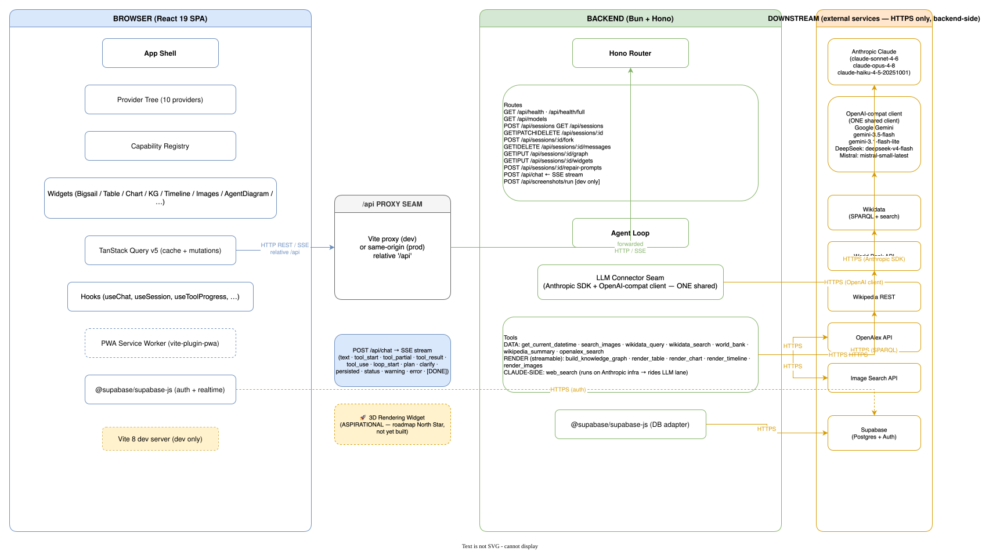

# Architecture

How Aether fits together. **Keep this current:** update it in the same commit that changes how
the pieces connect.

Last updated: Synced to code — added the `DELETE /api/sessions/:id/messages` route and the `persisted` / `warning` SSE events to their lists, noted ETag/304 on the conversation-read endpoints and the reused Anthropic client. Added the auto-generated draw.io diagram below.

---

## The diagram (auto-generated)

A detailed, multi-page draw.io diagram of every moving part — system overview, one chat turn,
frontend internals, backend internals. It's **generated from the live source** by
[`tools/architecture-diagram/`](../tools/architecture-diagram/README.md) (`bun run diagram`), so it
stays honest: a deterministic scanner reads the real routes/tools/providers/widgets and Claude
draws (or incrementally edits) the diagram from that digest.



> The image above is **page 1 (System Overview)**. The source file
> [`docs/diagrams/architecture.drawio`](./diagrams/architecture.drawio) has four pages — open it in
> [draw.io](https://draw.io) (or the desktop app) to see *One Chat Turn*, *Frontend Internals*, and
> *Backend Internals*, and to hand-tweak the layout (your edits survive the next incremental run).

---

## The one idea

> Every view is a question answered in its best form.

The **chat is the interface.** You ask a question; the answer comes back rendered in whatever
form fits it best — a table, a chart, a relationship graph, or a 3D scene. The 3D/graph/chart
layers are not separate apps; they are *how answers are displayed*.

---

## Monorepo shape

```
aether/
├── frontend/   React 19 + Vite + Tailwind v4   → runs in the browser
├── backend/    Bun + Hono + Anthropic + Supabase → runs on the server
├── docs/       this folder
└── README.md   build/run instructions + pointer to docs
```

Two independent packages. Each has its own `package.json`, `tsconfig.json`, and `biome.json`;
each is installed and run on its own (`bun install` / `bun dev` inside each). No Docker.

> Note: the package names are `@aether/frontend` and `@aether/backend`, which implies a bun
> workspace. There is no root `package.json` with `workspaces` yet — the packages are run
> independently. A root workspace can be added later if they need to share code.

---

## Two runtimes

The single most important architectural fact. Aether has two halves that run in two different
places, each needing a different runtime.

```
┌─────────────────────────┐         ┌──────────────────────────┐
│   FRONTEND (browser)    │  HTTP   │   BACKEND (your machine) │
│  React SPA              │ ──────> │  Hono server             │
│  runs in the browser's  │  /api   │  holds the API keys      │
│  JS engine (V8)         │ <────── │  calls Claude + Supabase │
└─────────────────────────┘         └──────────────────────────┘
        ↑                                      ↑
   browser = runtime,                   bun = runtime
   but only for COMPILED output         (the whole time)
```

- **The browser cannot run your source.** `.tsx`/`.ts` is TypeScript + JSX, which the browser
  has never heard of. **Vite** (running on bun) compiles source into browser-ready JS. The
  browser is the runtime for the *output*, not the source.
- **The backend never touches a browser.** It runs server-side on bun because it holds secrets
  (`ANTHROPIC_API_KEY`, Supabase service key). Secrets must never reach the client. **This is
  the reason the backend exists** — to keep keys off the browser and to be the single place that
  talks to Claude and the database.

So: the browser handles the last mile of the frontend; **bun handles everything a developer
does** — install, compile, run the server, run tests.

There's also a **third thing** running in the browser in production: a **service worker**. Aether
is an installable PWA — `vite-plugin-pwa` generates a Workbox SW (`dist/sw.js`) that precaches the
built assets so the app shell loads instantly and works offline-ish, and a web manifest so it can
be installed to the home screen / dock. The SW is a separate browser-managed script (not part of
the React tree); it's off in `vite dev` and active in preview/prod. `/api/*` is excluded from its
cache so data calls always hit the network. See [MOBILE.md](./MOBILE.md) for the full mobile/PWA
story and [RUNBOOK.md](./RUNBOOK.md#pwa--service-worker) for the operational details.

---

## Deployment topology — prod vs. dev

Where each half actually lives. "Two runtimes" said *what* the halves are; this says *who hosts
them* in each environment. The shape is the same in both — browser → frontend host → backend →
(database + LLM + data providers) — but the frontend is a **different server** in each, while the
backend is the **same Hono app**, just hosted differently.

```
PRODUCTION
  Browser ──HTTPS──▶ Vercel  (static React build, served + cached at the edge)
                       │  /api/*  edge proxy  ──▶  aether-ab-api.fly.dev
                       ▼
                     Fly.io   aether-ab-api   (Hono on Bun, in Docker; holds all secrets)
                       ├──▶ Supabase   (Postgres — sessions + messages)
                       ├──▶ LLM        Anthropic · Google · DeepSeek · Mistral   (keyed)
                       └──▶ Data       Wikidata · World Bank · Wikipedia · OpenAlex · Wikimedia · Unsplash
```

```
DEVELOPMENT
  Browser ──http──▶ Vite dev server  :5174   (HMR, compiles source live)
                      │  /api  proxy  ──▶  localhost:8000
                      ▼
                    Bun / Hono  :8000   (your machine; secrets from backend/.env)
                      ├──▶ Supabase   (the SAME project as prod — shared DB)
                      ├──▶ LLM        Anthropic · Google · DeepSeek · Mistral   (keyed)
                      └──▶ Data       Wikidata · World Bank · Wikipedia · OpenAlex · Wikimedia · Unsplash
```

**What changes between the two:** only the **frontend host** (Vercel static edge ↔ Vite live-
compile dev server) and the **backend host** (Fly Docker container ↔ local bun process). The
`/api` indirection exists in both for the same two reasons — no CORS, no hardcoded backend URL.

**What stays the same:** the Hono app, the `/api` contract, and every downstream provider.
**Secrets are server-side in both** (Fly secrets / `backend/.env`) and never reach the browser.

**Downstream providers** (all reached over HTTPS from the backend, identical in both environments):
- **Database** — Supabase Postgres. ⚠️ Dev points at the **same Supabase project as prod**, so
  local turns write real session rows; there is no separate dev database.
- **LLM providers** — Anthropic (default), Google, DeepSeek, Mistral. The model picker routes
  each turn by the chosen model's `provider` tag (`backend/src/models.ts`); `createClient()`
  (`backend/src/llm.ts`) maps that tag to a client — Claude on the Anthropic SDK, the other three
  on one shared OpenAI-compatible client (the `openai` SDK pointed at each provider's base URL).
  Keys are read lazily, so the app runs on Anthropic alone.
- **Data-lookup providers** — the data sources the backend's tools fetch from:
  **Wikidata** (`wikidata_search` + `wikidata_query` SPARQL), **World Bank** Open Data
  (`world_bank`), **Wikipedia** REST (`wikipedia_summary`), **OpenAlex** papers
  (`openalex_search`), and **Wikimedia Commons** + **Unsplash** for image search (`search_images`;
  Unsplash needs `UNSPLASH_ACCESS_KEY`, the rest are keyless). Defined in `backend/src/tools.ts`.

> One nuance the boxes can't show: Anthropic's **`web_search`** tool is *server-side on Anthropic's
> infrastructure* (Claude-only) — the host never calls `executeTool` for it, so it rides the LLM
> lane, not the data-lookup lane. Everything in the **Data** row above is fetched by *our* backend.

Live URLs, ports, dashboards, and the deploy/secrets commands live in
[RUNBOOK.md](./RUNBOOK.md) — this section is just the map.

---

## Frontend ↔ backend wiring (the `/api` proxy)

In dev, the frontend calls relative paths like `/api/chat`. Vite is configured
(`frontend/vite.config.ts`) to proxy `/api` → `http://localhost:8000` (the backend):

```ts
server: { proxy: { "/api": "http://localhost:8000" } }
```

Two benefits:
1. **No CORS in dev** — to the browser, the API looks same-origin.
2. **No hardcoded backend URL** in frontend code — it just calls `/api/...`.

The `:8000` port is a contract the backend honors: the Hono server binds `:8000` (overridable via
`PORT`). The proxy line and the server's port are two files that must agree. No CORS config is
needed in dev — the proxy makes the API look same-origin.

---

## The backend (`/api/chat`)

The backend is a Hono server (`backend/src/index.ts`) served by **bun's native server**
(`export default { port, fetch }` — no `@hono/node-server`). Routes today:

- `GET /api/health` → `{ ok: true }` — liveness, works before any API key is set.
- `GET /api/health/full` → full plumbing check: Supabase + all four LLM provider keys, run in parallel with a 5 s timeout each. Powers the System Health widget.
- `GET /api/models` → `{ models }` — the model allowlist for the picker, each tagged `available` by a **live provider health probe** (`checkProviders()` — the four billable 1-token LLM checks, split out of `/api/health/full`), cached in memory (~60 s TTL). The picker hides unavailable providers but the full list is always returned so past sessions can still resolve their saved model's label. If Claude (the default) is down, all are marked available rather than blanking the picker.
- `POST /api/chat` — one chat turn, streamed as SSE.
- `POST /api/sessions` — create a new session; returns `{ id }`.
- `GET /api/sessions?userId=...` — list sessions for a user (most-recent-first).
- `GET /api/sessions/:id` — load a single session row.
- `PATCH /api/sessions/:id` — patch a session row (`title`, `graph_mode`, `model`); returns `{ ok: true }`.
- `DELETE /api/sessions/:id` — delete a session; returns `{ ok: true }`.
- `POST /api/sessions/:id/fork` — fork a session into a new one for the same user.
- `POST /api/sessions/:id/repair-prompts` — backfill missing recreation prompts on a session's saved widgets.
- `GET /api/sessions/:id/messages` — load the full message history for a session.
- `DELETE /api/sessions/:id/messages` — delete one message pair (a user message + its assistant reply) from a session.
- `GET /api/sessions/:id/graph` / `PUT /api/sessions/:id/graph` — load / save the knowledge graph snapshot.
- `GET /api/sessions/:id/widgets` / `PUT /api/sessions/:id/widgets` — load / save the last table + chart specs for a session.

(Dev-only: `POST /api/screenshots/run` powers the `/screenshots` contact sheet; absent from prod builds.)

Note: writes return a JSON body (`{ ok: true }`), not an empty 204 — the frontend's `apiFetch`
tolerates an empty body defensively but no endpoint currently sends one.

```
request   {
            messages: { role: "user" | "assistant", content: string }[],
            sessionId?: string,   // omit to skip persistence
            userId?: string
          }
response  text/event-stream
  data: {"type":"text","content":"..."}   // one event per token
  data: {"type":"tool_partial","tool":"render_table","partialJson":"...","isComplete":false} // streamed render-tool spec
  data: [DONE]                            // stream complete
  data: {"type":"error","message":"..."}  // mid-stream error
error     { error: string }              // 400 (bad body) before streaming starts
```

The frontend sends the **full conversation** on every turn. After `[DONE]`, the backend saves
the user message and the complete assistant reply to Supabase (if `sessionId` + `userId` are
present). The auto-title is set from the first user message if the session has none yet.

### The LLM connector — a platform seam

The route never imports an LLM SDK. It calls `createClient(...).stream(...)` from
`backend/src/llm.ts`, a factory that picks the client from the chosen model's `provider` tag
(`backend/src/models.ts`; default model `claude-sonnet-4-6`). **Four providers are implemented:**
Claude on the Anthropic SDK (`createClaudeClient`), and Google / DeepSeek / Mistral on one shared
OpenAI-compatible client (`createOpenAICompatClient`, the `openai` SDK pointed at each provider's
base URL). Adding another OpenAI-compatible provider is a new `models.ts` entry, not a route
change. The system prompt (`backend/src/prompt.ts`) is sent as a cached content block
(`cache_control: ephemeral`). Provider clients are built lazily and keys read lazily, so the
server (and `/api/health`) start fine without a key, and an unset provider only fails a turn that
actually uses it.

**One loop, two adapters.** Both clients run the *same* agent loop — `runAgentLoop()` in
`backend/src/llm.ts`. It owns every wire-format-independent decision (the iteration cap + the
final "no tools, force a text answer" degrade, token accounting, the inter-iteration text
separator, the ~120 ms `tool_partial` throttle, the `max_tokens` salvage + degeneracy guard, tool
execution + self-correction). Each provider supplies a thin **`WireAdapter`** that normalizes its
SDK's stream into a small `LoopEvent` union (`text` · `tool_start`/`tool_delta`/`tool_meta` ·
`server_tool_start`/`server_tool_result` · `usage` · `stop`) and builds that provider's history
shape. The loop never names a provider: Anthropic's event taxonomy, the cache_read/creation split,
and server-side `web_search` live in the Claude adapter; OpenAI's chunk taxonomy and Gemini's
quirks (`thought_signature`, the `finish_reason="stop"`-with-a-tool-call bug, `MALFORMED_FUNCTION_CALL`)
live in the OpenAI-compat adapter. Adding a 5th provider is a new adapter + a `models.ts` entry —
the loop is reused, not re-implemented.

Tools are defined in `backend/src/tools.ts` (a `TOOLS` array of Anthropic-schema definitions plus
an `executeTool` dispatcher) and passed to `createClaudeClient` at construction time — the
`LlmClient` interface stays tool-agnostic. The `stream()` method accepts optional `onToolStart`,
`onToolResult`, and `onToolPartial` callbacks; the route uses these to emit `tool_start` /
`tool_result` / `tool_partial` SSE events. (Callbacks are positional in the `stream(...)`
signature — `onToolPartial` sits between `onToolResult` and `onLoopStart`; the SSE callback order in
`index.ts` must match.)

### Progressive rendering — render tools are pass-throughs

The render tools (`render_table`, `render_chart`, `render_timeline`, `render_images`,
`build_knowledge_graph`) do no work in `executeTool` — they `return JSON.stringify(input)`. So a
render tool's **result is the model's tool-input JSON, verbatim**. That single fact powers progressive
rendering: the agent loop forwards the streaming `input_json_delta` for these tools (the set is
`STREAMABLE_RENDER_TOOLS`) over a `tool_partial` event, throttled to ~one frame per 120 ms, in both the
Claude and OpenAI-compat clients. The widget repaints from the growing spec instead of waiting for the
whole block — so a big "compare everything" answer shows its first rows in ~1 s. The authoritative
`tool_result` still fires after execute; `tool_partial` is purely additive.

On the frontend, KnowledgeGraph feeds partials straight into its existing **additive, idempotent**
merge (the final `tool_result` reconciles without double-adding). Table/Chart/Timeline/Images share
`frontend/src/capabilities/widgets/useStreamingEntries.ts`, which **upserts one streaming entry in
place** as partials arrive, finalizes it on `tool_result`, and closes the slot on `done`/`error`/`idle`
(the salvage path emits a final partial but no `tool_result`, so without that close the next turn would
upsert into the stale entry).

### max_tokens salvage — keep what streamed

When the model runs out of output budget mid tool-call (`stop_reason="max_tokens"` /
`finish_reason="length"`), the partial JSON is unparseable. Instead of throwing the whole turn away,
the loop best-effort-closes it via `backend/src/bestEffortJson.ts` (`closeTruncatedJson` rewinds to the
last complete element and restores the open-bracket stack; `parseBestEffort` parses it), emits the
salvaged spec as a final `tool_partial`, and ends the turn with a soft status — _"That ran long —
showing what came through."_ Only when nothing is salvageable does it surface the hard error. The
`ANTHROPIC_MAX_TOKENS` default is 8192 (env-overridable), and the system prompt asks the model to emit
the most important rows/entities **first** so a cutoff loses the tail, not the headline.

On the frontend, the stream reader lives in `frontend/src/shell/useChat.ts`; message state is
lifted into `SessionContext` so both `ChatPanel` and `Sidebar` share it. `ChatPanel.tsx` is just
the view.

---

## The data layer — TanStack Query (`frontend/src/lib/queryClient.ts`)

Every **non-streaming** `/api` call goes through one `QueryClient` and one `apiFetch`. (Chat is
the exception — it's SSE, read directly in `useChat.ts`.) The shape:

- **One `apiFetch`** — the only place `fetch` is called. Throws a typed `ApiError` on non-ok,
  distinguishes network failures, and centralizes retry/backoff. Retries network + 5xx (so a Fly
  cold-start 502 resolves on its own) but never 4xx; backoff caps at 8s.
- **Reads are queries.** `useSessionList` (`sessionsKey(userId)`), `useHealth`, graph load.
  `sessionsKey(userId)` is the exported cache-key factory so any hook can target the same cache.
- **Writes are mutations** that **optimistically update then invalidate** `sessionsKey(userId)`.
  `useUpdateSession` applies the patch to the cached row in `onMutate` (so model/graph-mode
  toggles flip instantly instead of lagging a PATCH round-trip), rolls back in `onError`, and
  re-syncs in `onSettled`. Its `patch` is typed `Partial<Session>` so a snake_case key typo fails
  to compile.
- **Self-diagnostics.** The query/mutation caches' `onError` turn a raw `HTTP 502` into a
  plain-English, environment-aware reason (dev vs. prod, where `/api` points). A startup banner
  logs the mode + API target on every reload.
- **Conditional reads (ETag/304).** The conversation-read endpoints emit an `ETag`; a repeat read
  with `If-None-Match` gets a `304 Not Modified` (no body), so re-opening an unchanged session is
  cheap. The backend also reuses one Anthropic client instance across requests rather than
  constructing one per call.

This replaced a hand-rolled module-level cache + in-flight-promise singleton in the old model
picker — TanStack's request dedup (`staleTime`) does that job natively.

---

## Tooling: each tool has its own ignore

A cross-cutting fact that already cost time once and will again if forgotten:

**There is no master ignore file.** `.gitignore` configures **git only** (what gets committed).
Other tools do not read it:

| Tool | Reads | Controls |
|------|-------|----------|
| git | `.gitignore` | what gets committed |
| Biome | `biome.json` → `files.includes` | what gets linted/formatted |
| TypeScript | `tsconfig.json` → `include`/`exclude` | what gets type-checked |

So "just add it to `.gitignore`" only ever configures git. To stop Biome linting `dist/`, it
needs its own rule (`files.includes` with `!dist`). To stop tsc checking something, it needs
`exclude`. Three separate mechanisms for three separate tools.

(This bit the test setup too: Vitest's config has its own `exclude` for `e2e/**`, because
those are Playwright specs — see Testing below.)

---

## Testing

Three layers, each owning a different question. Run commands live in `RUNBOOK.md`; this is
*what* each layer covers and *why it's shaped this way*.

| Layer | Runner | Lives in | Answers |
|-------|--------|----------|---------|
| Frontend unit | Vitest + jsdom | `frontend/src/**/*.test.ts(x)` | Does this parser/hook/state-reducer compute the right value? |
| Backend unit | `bun:test` | `backend/src/**/*.test.ts` | Does this tool-shape / planner / JSON-salvage logic hold? |
| End-to-end | Playwright | `frontend/e2e/**/*.spec.ts` | Does the real app, in a real browser, actually work — desktop **and** mobile? |

**Unit tests** cover the pure, value-producing pieces: SSE parsing (`parseSseChunk`), spec
parsers (`parseTableSpec`, `parseChartSpec`), the capability/streaming-entries state math,
and on the backend the tool input shapes, planner, and `bestEffortJson` salvage. They run
without a browser (jsdom) or a network. `bun run build` runs the frontend unit suite first,
so a failing unit test blocks the build.

**E2E** is the layer that guards the paths that kept regressing — especially mobile. Its
defining choice: **`/api` is mocked at the network layer**, not hit for real.

- `e2e/fixtures/sse.ts` builds canned SSE bodies in the exact wire format the frontend
  expects — `data: <json>\n` per line, terminated by `data: [DONE]\n` (the framing
  `parseSseChunk` parses), with the real tool names (`render_table`, not `table`).
- `e2e/fixtures/mockApi.ts` is a composable `page.route("**/api/**")` handler exposed as a
  Playwright fixture. It serves every route the app touches on load (sessions, models,
  health, messages, graph, widgets) and streams a chosen chat scenario (`streamText`,
  `streamTable`, `holdChat` for the stop/abort path). Tests override per-route as needed.
- Result: **no backend process, no LLM tokens, deterministic** — fits the light-budget demo
  and lets CI run with zero secrets. Stop the Hono server and the suite still passes.

**The viewport matrix** (`e2e/devices.ts`) is the other half of the strategy: one desktop
project plus iPhone/iPad/Pixel each in **portrait and landscape** = 7 projects. WebKit backs
the iPhone/iPad (Safari, the regression-prone surface); Chromium backs desktop + Android.
This same matrix powers the dev-only `/screenshots` contact sheet, so the gallery never
drifts from what the tests exercise. The mobile-only specs (`mobile-layout`, `sidebar`) gate
on viewport **width < 768px** (the `useIsMobile` breakpoint) — they `test.skip` on desktop,
iPad, and landscape phones, because the drawer/canvas-overlay shell only exists below `md`.

**Specs** (`frontend/e2e/`): `smoke` (loads, no console errors — every viewport), `chat-flow`
(send + stop/abort), `render-tool` (one full SSE→bus→provider→widget round trip), and the
mobile-gated `mobile-layout` (drawer, canvas overlay, orientation, touch targets) and
`sidebar` (rename + delete from the drawer).

**Two timing realities worth knowing** (both bit during bring-up):
- *Don't render-tool from the home route.* A first message creates the session mid-stream,
  and `WidgetPersistenceBridge`'s clear-on-session-change can race — and wipe — an incoming
  `tool_result`. The render-tool spec sends from an already-loaded session so there's no
  session change to race.
- *The dev server flakes under full parallel load* (it compiles live). The robust full run
  uses the built preview server (the default `test:e2e` / CI); the `:dev` variants are for
  watching one flow in UI mode. Local runs get 1 retry (CI 2) to absorb the odd hiccup —
  safe because the mock is deterministic, so a retry can't paper over a real bug.

**CI** (`.github/workflows/ci.yml`) runs all three layers as parallel jobs (`frontend-unit`,
`backend-unit`, `e2e`) on every PR and push to `main` — the first automated gate this repo
has had. The e2e job builds its own preview server and needs no secrets.

---

## The shell — three-zone layout

The app is one persistent shell with three horizontal zones. This is the frame every experience
runs inside; it is the platform's primary surface.

```
┌──────────┬───────────────────────────┬──────────────────────────────────┐
│          │                           │                                  │
│  SIDEBAR │      CHAT (body)          │     CAPABILITY COLUMN            │
│          │                           │                                  │
│  logo    │   messages                │   [ tab | tab | tab ]  ⛶  ×      │
│  nav     │   …                       │   ┌──────────────────────────┐   │
│          │                           │   │  active widget           │   │
│  convos  │   ┌─────────────────────┐ │   │  (3dverse / data / …)    │   │
│   • …    │   │ type a message…  ↑  │ │   └──────────────────────────┘   │
│          │   └─────────────────────┘ │                                  │
└──────────┴───────────────────────────┴──────────────────────────────────┘
  resizable          resizable boundary        resizable · closable
  collapsible
```

**Zones**
- **Sidebar** — resizable, collapsible. Logo + nav (top), conversation history (list).
- **Chat (body)** — message transcript + composer. Full width when alone; narrows when the
  capability column opens.
- **Capability column** — hosts widgets behind a **fixed chip toolbar**. The chip set is
  constant (**Tiles** (Bigsail) + Knowledge Graph + Table + Chart + Timeline + Images, plus
  right-pinned gear/Settings and help/Welcome). It is **always present** — **Tiles is "home base"**
  (the first chip and the default landing view; it mirrors every render-tool spec as live
  draggable/resizable cards) and never turns off — so the column can't launch collapsed or
  off-screen. **Fullscreen-capable** (expands over the chat, then restores). Resizable. Width is
  **device-local chrome**: it lives only in localStorage (clamped to a safe band), never in
  conversation state.

**Two states** (the column is always present; there is no chat-only state)
```
1. SPLIT                                  2. CAPABILITY FULLSCREEN
┌────┬─────┬──────────────────┐           ┌────┬───────────────────────────┐
│ SB │chat │[◆ ▦ ◔ ⋯][⚙ ?]    │           │ SB │ [◆ ▦ ◔ ⋯][⚙ ?]            │
│    │     │ active widget    │     →     │    │   active widget           │
└────┴─────┴──────────────────┘           └────┴───────────────────────────┘
   chips: unfilled=no content · filled=has content · ring=active · pink dot=unseen
```

Panel resize/collapse is handled by **`react-resizable-panels`** (resizable, collapsible panel
groups) rather than hand-rolled drag math.

> **⚠️ Unit trap (`react-resizable-panels` v4).** A size value's unit depends on which API
> consumes it, and the mismatch is invisible to TypeScript/biome because every size prop accepts
> `number | string`:
> - `defaultSize` prop — bare number coerces toward percent; explicit strings (`"32%"`, `"240px"`) are honored.
> - `onResize(size)` — hands you both `{ asPercentage, inPixels }`; pick the right one.
> - **`panel.resize(x)` — a bare number is read as PIXELS, not percent.** Storing a percent and
>   calling `resize(32)` opens the panel to 32 *pixels* (an invisible sliver), not 32%.
>
> **Rule: always pass units as explicit strings (`"32%"`, `"240px"`), never bare numbers** — even
> though numbers typecheck fine. This px-vs-% confusion is what made capability-panel resize
> persistence fail repeatedly; the bug compiles clean and only shows up at runtime. The column is
> now **always present** (no collapse/expand imperative calls): it just mounts at a clamped,
> localStorage-or-default width via `defaultSize`. See `frontend/src/shell/Shell.tsx`.

## The capability registry — the first platform seam

The capability column is a small managed system that **both the agent and the user act on**. Two
pieces:

```
            ┌─────────────────────────────┐
  agent  ──▶│   capability store          │◀──  user
  (tools)   │   { activeId, unseen[],     │     (tap a chip, resize,
            │     isFullscreen }          │      fullscreen, help/gear)
            └─────────────────────────────┘
                         │
                         ▼
   Fixed chip toolbar (catalog.tsx) + the renderer for the active id
```

- **The capability set is fixed**, not a per-conversation open/close tab lifecycle. `catalog.tsx`
  lists every capability; the toolbar always renders one chip each. The store tracks only *which*
  view is active, which capabilities have **unseen** content (the pink glow), and fullscreen.
  Whether a chip is "filled" (has content) is read **live** from each widget's state provider
  (`useCapabilityContent`), never stored.
- **Renderers are plugins keyed by `type`.** Each widget registers a renderer (`registerRenderer`)
  against a `type` that equals its id; the column hands a `{ id, type, title, state }` descriptor
  to the matching renderer. The shell never knows what's inside a widget.
- **The agent drives content, not tabs.** Tool results flow into the per-widget state providers
  (mounted at the app root so they never miss a payload). When new content lands on a non-active
  capability, ChatPanel flags it `unseen`; the chip glows until the user opens it.
- **Restore on load** sets the active view (remembered per-conversation in `ui_state.activeWidget`,
  falling back to home base) and glows every content-bearing capability the user isn't already on.
  Column **width is never** part of this — it's device-local localStorage chrome, so a shared link
  opened on another browser inherits the active view but not this machine's sizing.

New experiences plug in by adding a catalog entry + registering a renderer; nothing else changes.

---

## Data flow

One chat turn, end to end:

```
user message
   → frontend POST /api/chat
   → Hono handler (streamSSE)
   → Claude call via connector (stream)
   → SSE token events → frontend reader
   → tokens appended live in the chat
   → agent loop: tool_use? → executeTool
       → render tool? → stream tool_partial as the JSON arrives (progressive paint)
       → feed tool_result back → continue
       → exits when stop_reason !== "tool_use"
       → on max_tokens: salvage the partial render spec, end with a soft status
```

SSE wire format — all event types:
```
data: {"type":"text","content":"..."}              // one event per token
data: {"type":"tool_start","tool":"...","input":{}} // tool call beginning
data: {"type":"tool_partial","tool":"...","partialJson":"...","isComplete":false} // streamed render-tool spec (progressive paint)
data: {"type":"tool_result","tool":"...","result":"..."} // tool result fed back
data: [DONE]                                       // stream complete
data: {"type":"error","message":"..."}             // mid-stream error
```
(Other event types the route emits: `status`, `loop_start`, `plan`, `clarify` (the thin-but-
explodable clarifier question), `persisted` (carries the real DB row IDs after the turn is saved,
so the frontend's placeholder message IDs become the saved ids), and `warning` (a non-fatal notice,
e.g. persistence failed mid-stream). The `tool_partial` stream is render-tools-only — see
the progressive-rendering and salvage notes above.)

The agent loop runs entirely on the backend; the frontend sees only SSE events. Tool
definitions live in `backend/src/tools.ts`; the loop in `backend/src/llm.ts`.

**Persistence layer:**

```
user message
   → frontend POST /api/chat (with sessionId + userId)
   → [DONE] received
   → backend saves user + assistant messages to Supabase
   → sidebar fetches GET /api/sessions?userId=...
   → clicking a session loads GET /api/sessions/:id/messages
```

Anonymous identity: a UUID stored in `localStorage` under `aether_user_id` (created on first
visit, stable across reloads). No login required. `SessionContext` owns the session lifecycle;
`useSession` creates a new session on mount and on "+ New conversation" clicks.

### Persisted-JSON schema versioning (`lib/schemaVersion.ts`)

Every tool that persists structured JSON — the knowledge graph (`graph_data`), the render-tool
widget specs (`widget_data`), and the Tiles layout (`ui_state.tilesLayout`) — stamps its blob with
a per-tool `schemaVersion` integer. On load we compare the stamp against the tool's current version
and run a shallow shape guard. A mismatch (old version, missing stamp, corrupt shape) means we
**discard the blob and fall back to first-run empty state**, then surface a single subtle toast:
_"Your saved state was from an older version and has been reset."_

The backend never interprets these shapes — it round-trips opaque jsonb — so versioning lives
entirely on the frontend, inside the existing blob (the graph/widget stamp rides inline as a
sibling key; Tiles uses `ui_state.tilesLayoutVersion` because its array is awkward to stamp inline).
No DB migration: legacy rows simply lack the stamp and get discarded on next load, which is the
intended behavior.

**Regeneration, not migration.** "Discard and regenerate" does **not** mean firing a Claude call on
load. These snapshots are byproducts of a conversation turn (the model emits tool calls that build
them); there's no standalone regen endpoint, and auto-spending tokens on every stale load is exactly
what a light-budget demo must avoid. So regenerate = clear to empty → let the user's next turn
naturally repopulate it. There is no forward-migration chain and no global app version — each tool
owns its integer independently.

**Version-bump policy:** bump a tool's number in `SCHEMA_VERSIONS` on a **breaking** shape change
(rename/remove a field, change a type, restructure nesting) — that's the deliberate lever to blow
away every already-saved blob for that tool. **Don't** bump for purely additive optional fields;
read those defensively (`x ?? default`). The shape guard is the safety net for corruption that slips
through without a bump.

See [ROADMAP.md](./ROADMAP.md) for what's next.
