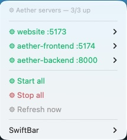

# SwiftBar dev-server control panel

A macOS menu-bar panel to start/stop the Aether + website dev servers and watch their
up/down status, without juggling terminals. **Optional** — two `bun run dev` terminals do the
same job. macOS-only (SwiftBar is a Mac menu-bar app).

The menu-bar glyph (𑁍) is teal when all servers are up, red when something's down. The
dropdown has:

- **Per server** — a Start/Stop toggle + "Open log", and (for website + aether-backend) a
  manual deploy action (website → FTP/ASL, backend → `fly deploy`). The **orion-web** row also has
  an **"Open Orion"** link and a **"Build Orion web (`bun run build`)"** action — prod serves
  `web/dist`, so frontend source changes only show after a rebuild.
- **Tests** submenu — launchers that open a Terminal window (too long/loud for the menu): full
  E2E run, E2E **UI mode**, frontend unit (vitest), backend unit (`bun test`), and the
  screenshots capture. UI mode + screenshots need the frontend dev server up on :5174.
- **Docs** submenu — opens each `docs/*.md` (and the repo) on GitHub in your browser.
- **Start all / Stop all / Refresh now**.



## What it manages

| Server | Port | Up-check |
|--------|------|----------|
| website | 5173 | HTTP 200 on `/` |
| aether-frontend | 5174 | HTTP 200 on `/` |
| aether-backend | 8000 | `/api/health` returns `{"ok":true}` |
| orion-web | 5176 | HTTP 200 on `/` |
| orion-api | 3000 | `/api/stats` returns JSON with `total` |

## Install

1. Install SwiftBar: `brew install --cask swiftbar` (launches as `/Applications/SwiftBar.app`).
2. On first run SwiftBar asks for a **plugin folder** — pick (or create) one, e.g.
   `~/Library/Application Support/SwiftBar/Plugins`.
3. Copy (or symlink) the plugin into that folder — symlink keeps it in sync with the repo:
   ```bash
   ln -sf "$PWD/aether-servers.3s.sh" "$HOME/Library/Application Support/SwiftBar/Plugins/aether-servers.3s.sh"
   ```
   (Run from `tools/swiftbar/`.) The `.3s.` in the filename tells SwiftBar to refresh every
   3 seconds — keep it.
4. SwiftBar → **Refresh all** (or it picks it up within a few seconds). The 𑁍 glyph appears.

## Notes / assumptions

- Paths derive from `$HOME`, so it works under any username. It assumes your checkouts live
  under `~/Code` (`~/Code/aether`, `~/Code/website`) — if not, edit `CODE_DIR` (or the
  `SERVERS` registry) at the top of the script.
- GUI apps don't inherit the login-shell PATH, so the script calls every external tool by
  absolute path (`$HOME/.bun/bin/bun`, `$HOME/.fly/bin/fly`, `/usr/sbin/lsof`, `/usr/bin/curl`).
  If a tool lives elsewhere on your machine, fix the path constants near the top.
- Up-checks probe `http://localhost:PORT` (not `127.0.0.1`) on purpose — Vite sometimes binds
  IPv6-only, and an IPv4-only probe would mis-report a healthy server as down.
- Logs are written to `/tmp/<name>.log`; "Open log" opens them in Console.app.
